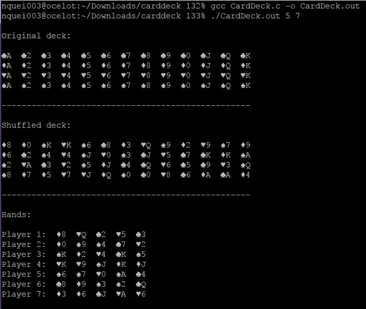

# Card-Deck
Simulates and deals deck of cards

## Objective:
Write algorithms and programs to simulate a deck of cards and deal hands of cards. Conventional deck of cards has 52 cards: 13 ranks and 4 suits. Your simulation should be able to create a deck of cards, display the original deck, shuffle the deck, display the shuffled deck, deal the specified number of cards to the specified number of players (via command-line) and display each of the hands of cards. 

## Input:
Accept input via the command-line arguments. Validate command-line input. Input will specify the # of cards/hand and the # of hands (players), in that order.

## Output:
Display the original deck (ordered) and the shuffled deck (random), and display each of the player’s hands of cards. Decks, hands and cards should be clean, clear and appropriately labeled, and easy to read - do not simply list as a long column or row of values. No graphics for suit/rank is required (but is attractive), but a simple code for each will suffice – as long as it is easy to understand.

## Screenshot:

